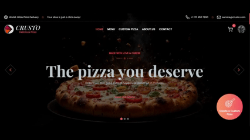

<h1 align="center" style>
  <br>
  <a href="https://crusto.onrender.com" target="_blank"></a>
  <br>
  Crusto
  <br>
</h1>

<h4 align="center">A pizza delivery platform that lets you create custom pizzas.</h4>

<p align="center">
  <a href="" target="_blank">
      
  </a>
  <a href="https://choosealicense.com/licenses/apache" target="_blank">
      
  </a>
  <a href="" target="_blank">
      
  </a>
  <a href="" target="_blank">
    
  </a>
</p>

<p align="center">
  <a href="#key-features">Key Features</a> •
  <a href="#how-to-use">How To Use</a> •
  <a href="#how-to-contribute">How To Contribute</a> •
  <a href="#technologies">Technologies</a> •
  <a href="#license">License</a>
</p>



**Live Demo**🔗 [https://crusto-two.vercel.app](https://crusto-two.vercel.app/)

**Admin Credentials**

```
> Email: admin@gmail.com
> Password: Admin@123
```

## Key Features

-   Custom Pizza Builder - Choose ingredients and build pizzas

-   Order Tracking - Real-time status updates

-   User Accounts - Save preferences and history

-   Secure Payments - Multiple payment options

-   Admin Dashboard - Manage inventory and orders

-   Low Stock Alerts - Email notifications for low ingredients

-   Analytics - Sales reports and insights

-   Dynamic Pricing - Auto-calculate costs and availability

-   Mobile Responsive - Works on all devices

## How To Use

To clone and run this application, you'll need [Git](https://git-scm.com) and [Node.js](https://nodejs.org/en/download/) (which comes with [npm](http://npmjs.com)) installed on your computer. From your command line:

##### Clone this repository

```bash
$ git clone https://github.com/kunaldas01/crusto-pizza-delivery-app
$ cd crusto-pizza-delivery-app
```

##### Frontend setup (Terminal 1)

```bash
$ cd client
$ npm install
$ cp .env.example .env # Configure variables
$ npm run dev
```

##### Backend setup (Terminal 2)

```bash
$ cd server
$ npm install
$ cp .env.example .env  # Configure variables
$ npm run dev
```

##### Background Workers setup

```bash
# Terminal 3
$ cd server
$ npm run dev:price        # Price calculations

# Terminal 4
$ cd server
$ npm run dev:availability # Stock management
```

## How to Contribute

1. Clone repo and create a new branch: `$ https://github.com/kunaldas01/crusto-pizza-delivery-app -b name_for_new_branch`.
2. Make changes and test
3. Submit Pull Request with comprehensive description of changes

## Emailware

Crusto is an [emailware](https://en.wiktionary.org/wiki/emailware). Meaning, if you liked using this app or it has helped you in any way, I'd like you send me an email at <kunaldas.inc@gmail.com> about anything you'd want to say about this software. I'd really appreciate it!

## Technologies

This software uses the following technologies:

-   React.js
-   Typescript
-   Node.js
-   Express.js
-   MongoDB
-   Redis
-   BullMQ

## Support

If you like this project and think it has helped in any way, consider buying me a coffee!

<a href="" target="_blank"></a>

## License

Apache 2.0

---

> [kunaldas.com]() &nbsp;&middot;&nbsp;
> GitHub [@kunaldas01]() &nbsp;&middot;&nbsp;
> Twitter [@kunaldas]()
